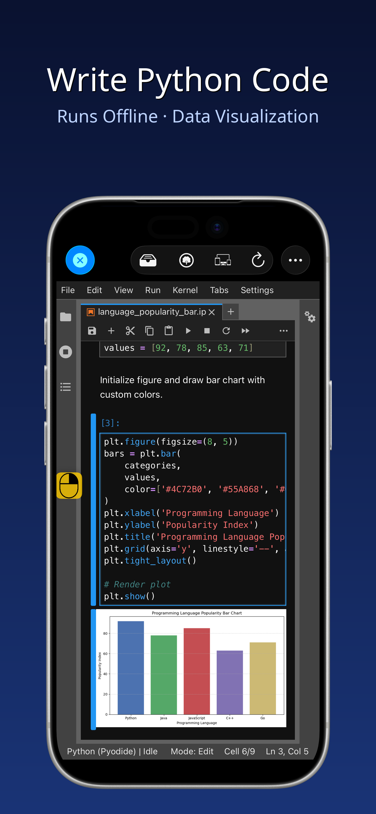
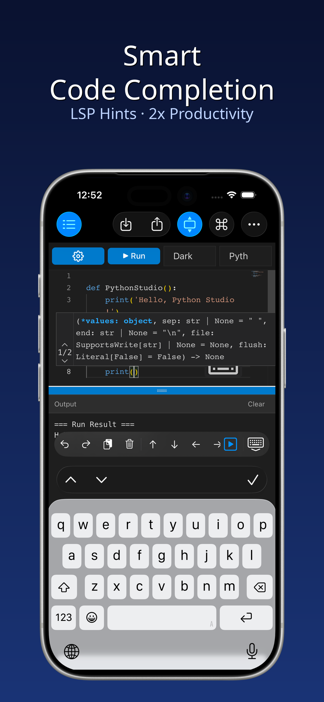
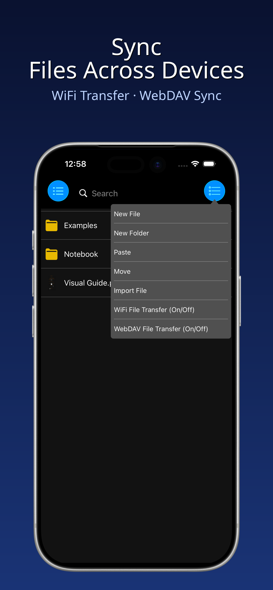
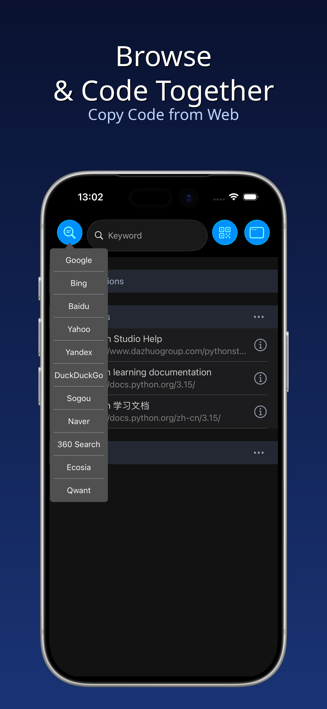
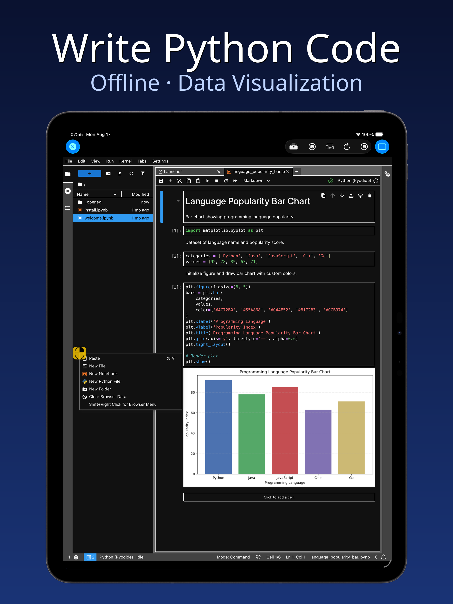
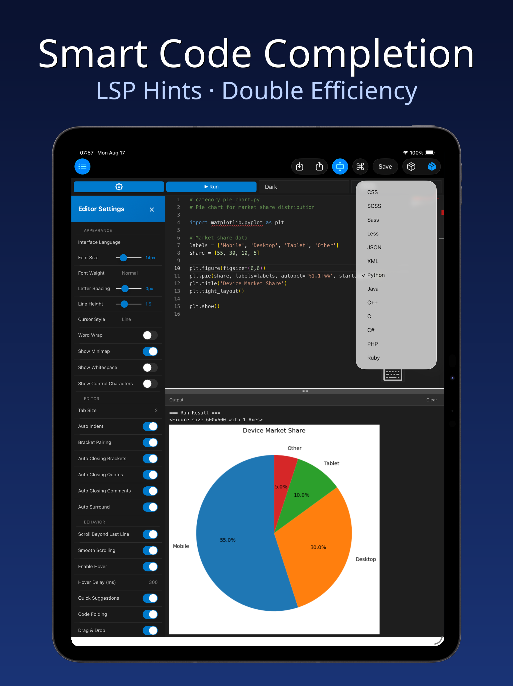
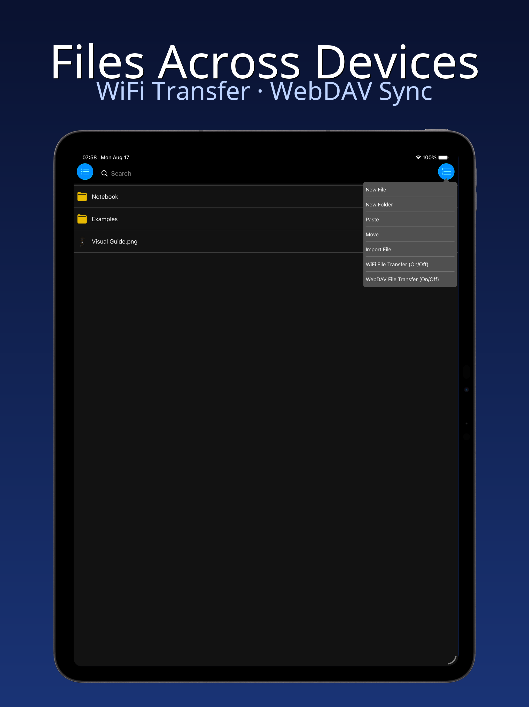
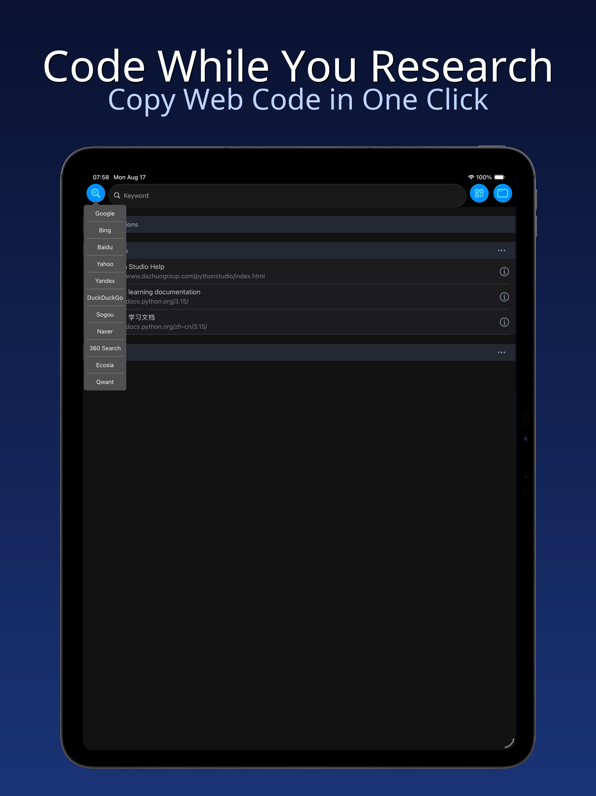

  

<h1 align="center">PythonStudio · Python Development Tool for Mobile</h1>

  <strong>Turn your iPhone / iPad / Mac into a portable Python coding workshop</strong>

  <a href="#highlights">Highlights</a> ·
  <a href="#architecture">Architecture</a> ·
  <a href="#screenshots">Screenshots</a> ·
  <a href="#getting-started">Getting Started</a> ·
  <a href="#privacy--terms">Privacy &amp; Terms</a>

  🌐 <a href="README.md">简体中文</a> · <a href="README.ja.md">日本語</a> · <a href="README.ko.md">한국어</a> · <a href="README.es.md">Español</a>

---

PythonStudio is built specifically for iPhone, iPad and Mac (Mac Catalyst), bringing the convenience and power of Python programming to mobile devices. Whether you are a beginner exploring the world of code or an experienced developer, you will find an efficient and smooth coding experience here — intuitive interactions remove the learning barrier, and rich features cover the full development workflow.

## Highlights

- **Write & Run Scripts Instantly**: No complex setup required — write, edit and run Python scripts directly on your device with real-time output;
- **Smart Coding Assistance**: Syntax highlighting, auto-indentation and intelligent code completion reduce syntax errors at the source, keeping you focused and productive;
- **Cross-Device File Management**: A lightweight, efficient file manager seamlessly connects project files between your computer and mobile device;
- **Built-in Browser for Learning**: Access programming resources without leaving the app — read docs, watch tutorials and write code side by side;
- **Flexible Multi-Window**: Open multiple windows at once, drag to reposition, pinch to resize, split-screen to compare code and research simultaneously;
- **Code Snippets (Monaco Editor)**: Built-in Monaco editor for quick code snippets with graphical output;
- **Jupyter Notebook Support**: Built-in JupyterLite kernel to open, edit and run `.ipynb` notebooks — fully offline.

## Architecture

| Module | Technology |
| --- | --- |
| UI | UIKit / Swift / Objective-C |
| Code Editor | Monaco Editor (embedded Web) |
| Python Kernel | JupyterLite (WASM, runs locally, no network required) |
| Local Server | Native BSD Socket static server (replaces Node engine) |
| File Sync | Bidirectional sync between local filesystem and Jupyter virtual filesystem |
| Multi-Window | Custom floating window manager (WindowControllerAdder) |
| Cross-Screen | LAN web service + browser access |

## Screenshots

### iPhone

  
  
  
  

### iPad

  
  

  
  

## Getting Started

> This repository contains only project introduction and metadata — no source code. It is an iOS / iPadOS / macOS (Catalyst) application.

1. Search for "Python 编程" on the **App Store** or visit the official page to download;
2. On first launch, the app automatically unpacks and initializes the local Jupyter kernel;
3. Open "Code Snippets" to write and run Python code;
4. Import `.py` / `.ipynb` / `.md` / `.csv` files for editing.

## Privacy &amp; Terms

- Privacy Policy: <http://www.dazhuogroup.com/pythonstudio/privacy_statement_en.php>
- Terms of Use: <http://www.dazhuogroup.com/pythonstudio/terms_of_use_en.php>

## License

The metadata and introduction content in this repository are copyrighted. All rights reserved. Source code is not publicly available.
