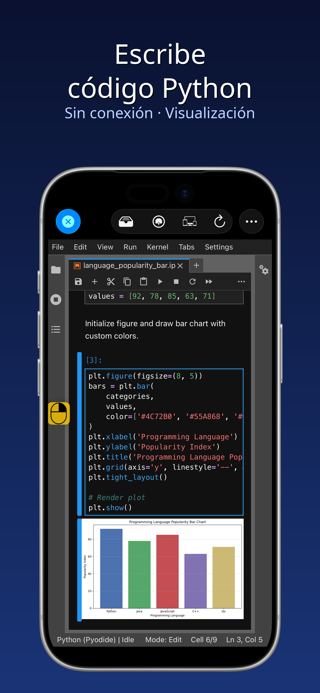
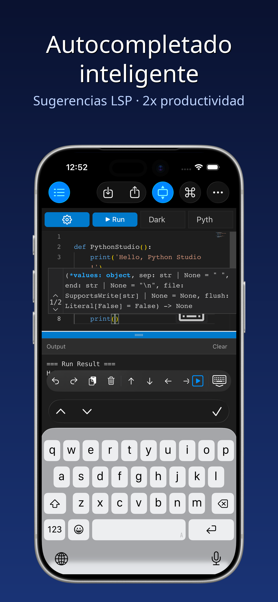
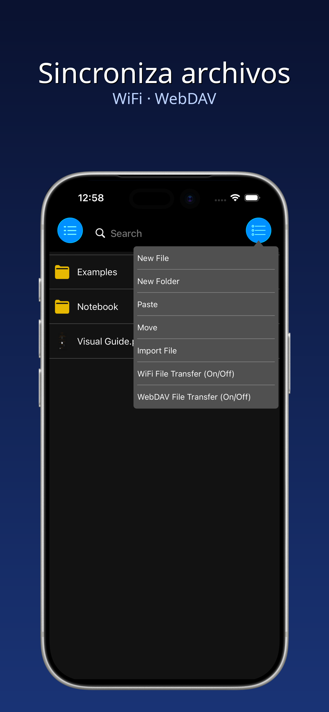
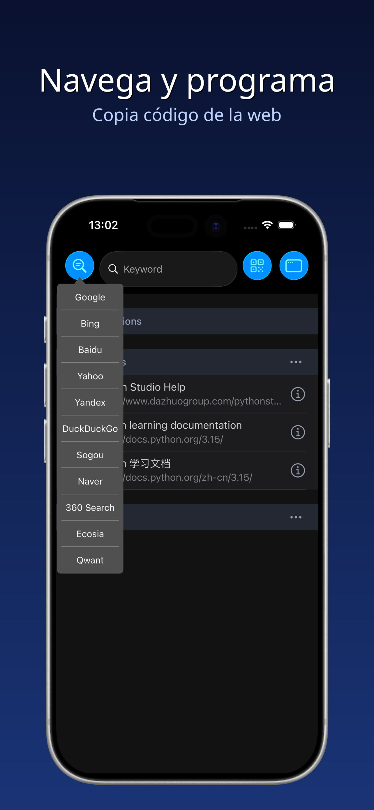
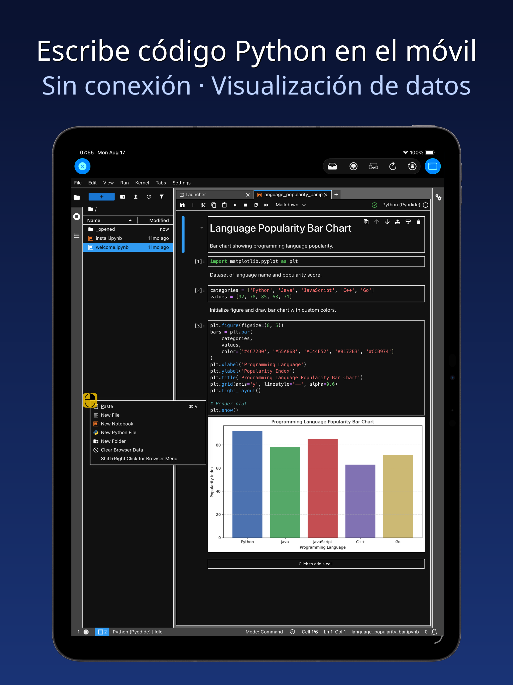
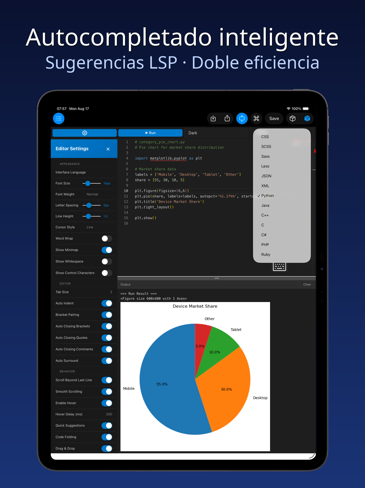
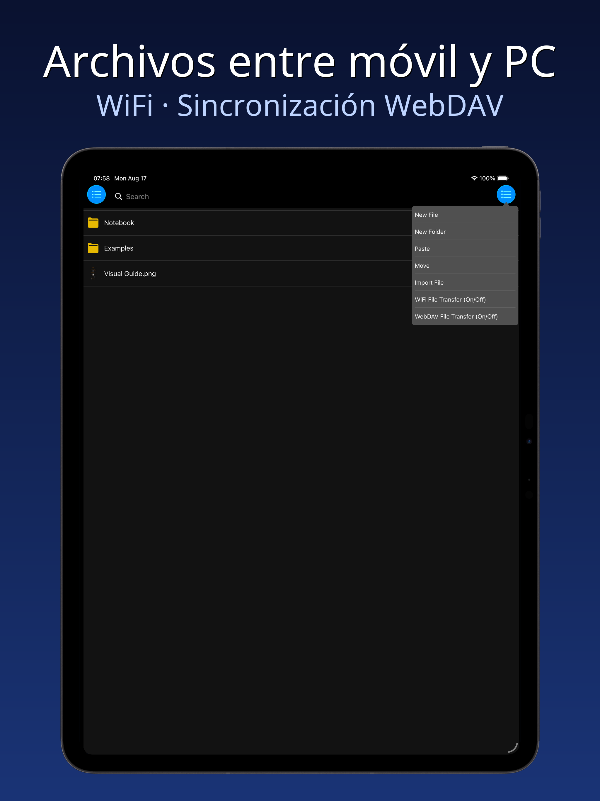
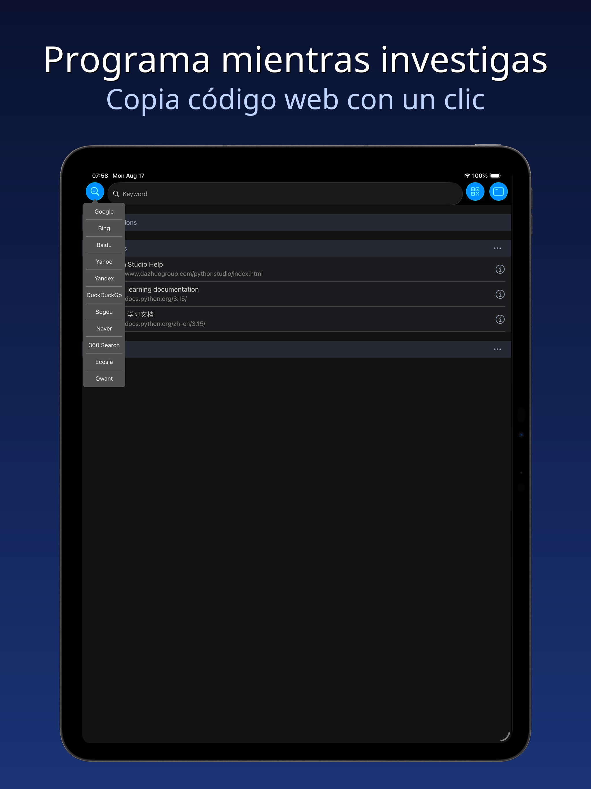

  

<h1 align="center">PythonStudio · Herramienta de desarrollo Python para móviles</h1>

  <strong>Convierte tu iPhone / iPad / Mac en un taller de programación Python portátil</strong>

  <a href="#características">Características</a> ·
  <a href="#capturas">Capturas</a> ·
  <a href="#primeros-pasos">Primeros pasos</a> ·
  <a href="#privacidad-y-términos">Privacidad y términos</a>

  🌐 <a href="README.md">简体中文</a> · <a href="README.en.md">English</a> · <a href="README.ja.md">日本語</a> · <a href="README.ko.md">한국어</a>

---

PythonStudio está diseñado específicamente para iPhone, iPad y Mac (Mac Catalyst), y aporta la comodidad y potencia de la programación Python a los dispositivos móviles. Tanto si eres un principiante que se adentra en el mundo del código como un desarrollador con experiencia, aquí encontrarás una experiencia de codificación fluida y eficiente: interacciones intuitivas que eliminan barreras y funciones completas que cubren todo el flujo de desarrollo.

## Características

- **Escribe y ejecuta al instante**: sin configuración compleja, escribe, edita y ejecuta scripts de Python directamente en el dispositivo con resultados en tiempo real;
- **Asistencia de codificación inteligente**: resaltado de sintaxis, sangría automática y autocompletado inteligente reducen los errores de sintaxis de raíz, manteniéndote concentrado y productivo;
- **Gestión de archivos entre dispositivos**: un gestor de archivos ligero y eficiente conecta sin problemas los archivos de tu proyecto entre el ordenador y el móvil;
- **Navegador integrado para aprender**: accede a recursos de aprendizaje de programación sin salir de la app — lee documentación, mira tutoriales y escribe código a la vez;
- **Multiventana flexible**: abre varias ventanas a la vez, arrastra para reposicionar, haz zoom para redimensionar y usa pantalla dividida para comparar código y consultar referencias;
- **Fragmentos de código**: editor de código integrado y eficiente para fragmentos rápidos con salida gráfica;
- **Compatibilidad con Notebook**: abre, edita y ejecuta cuadernos `.ipynb` — totalmente sin conexión.

## Capturas

### iPhone

  
  
  
  

### iPad

  
  

  
  

## Primeros pasos

> Este repositorio contiene únicamente la introducción y los metadatos del proyecto — no incluye código fuente. Es una aplicación para iOS / iPadOS / macOS (Catalyst).

1. Busca «Python 编程» en la **App Store** o visita la página oficial para descargarla;
2. En el primer inicio, la app completa automáticamente la inicialización y queda lista para usar;
3. Abre «Fragmentos de código» para escribir y ejecutar código Python;
4. Importa archivos `.py` / `.ipynb` / `.md` / `.csv` para editarlos.

## Privacidad y términos

- Política de privacidad: <http://www.dazhuogroup.com/pythonstudio/privacy_statement_en.php>
- Términos de uso: <http://www.dazhuogroup.com/pythonstudio/terms_of_use_en.php>

## License

El contenido de metadatos e introducción de este repositorio está protegido por derechos de autor. Todos los derechos reservados. El código fuente no está disponible públicamente.
