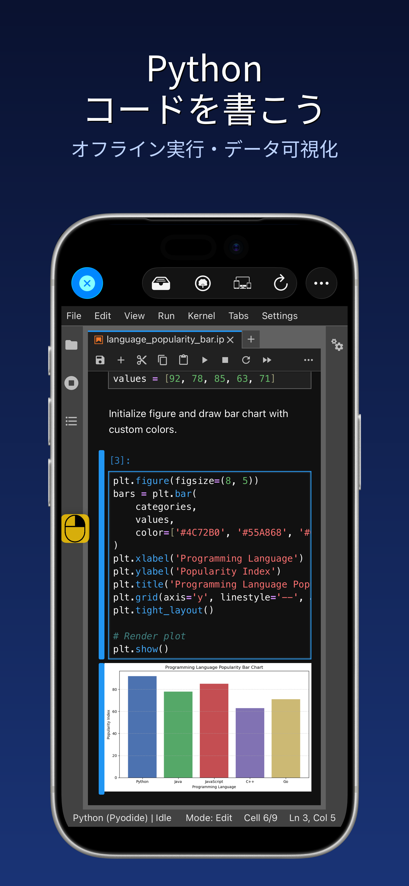
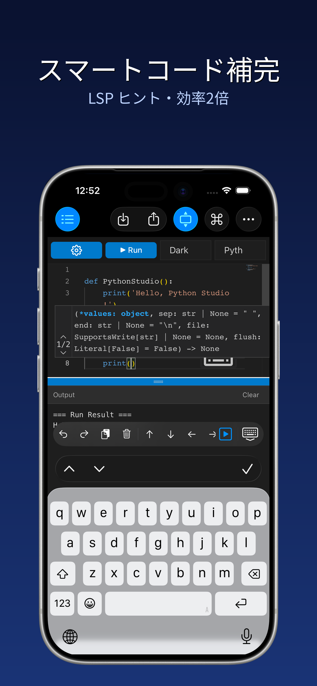
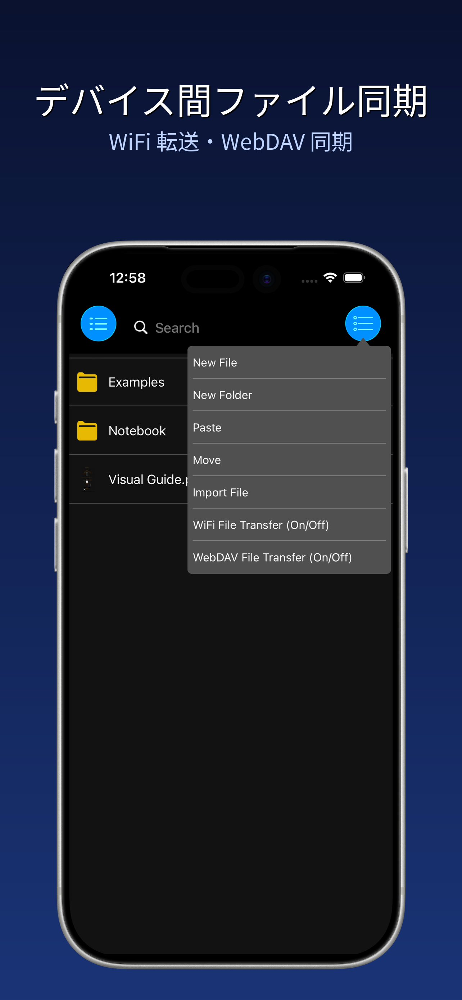
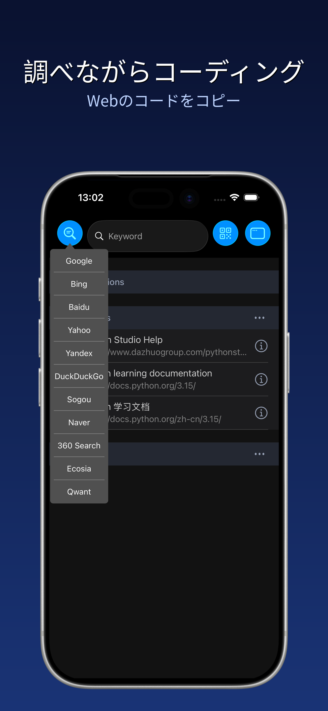
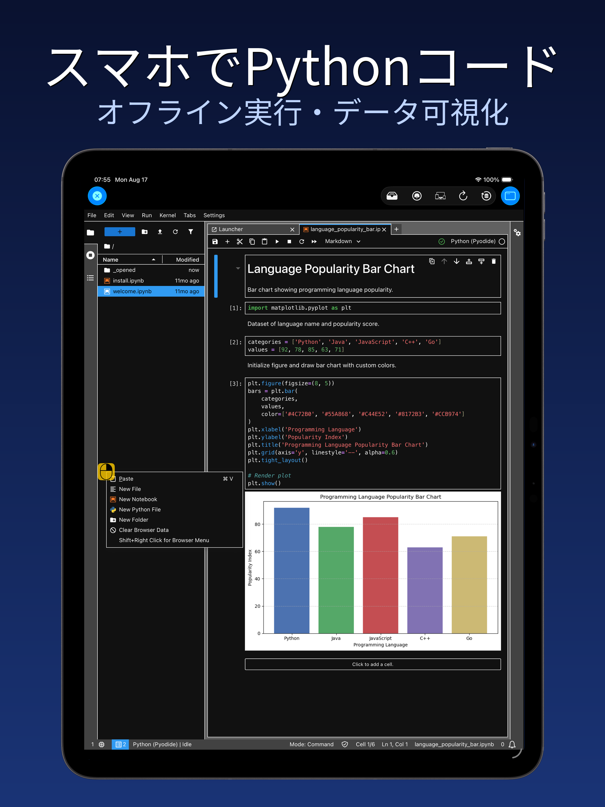
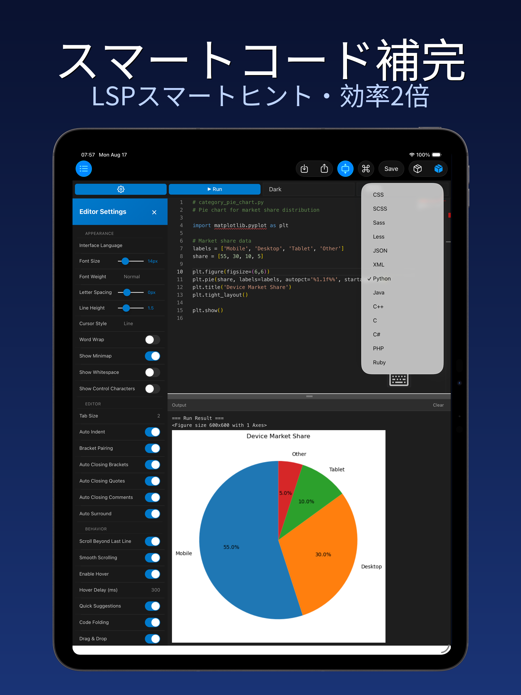
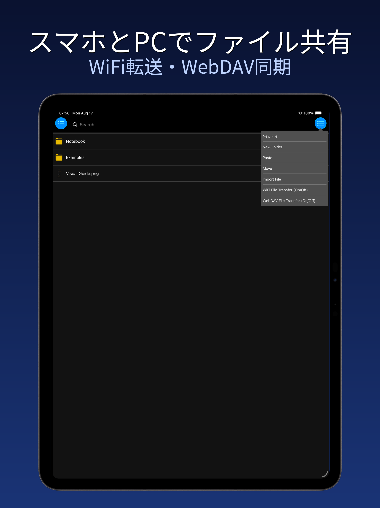
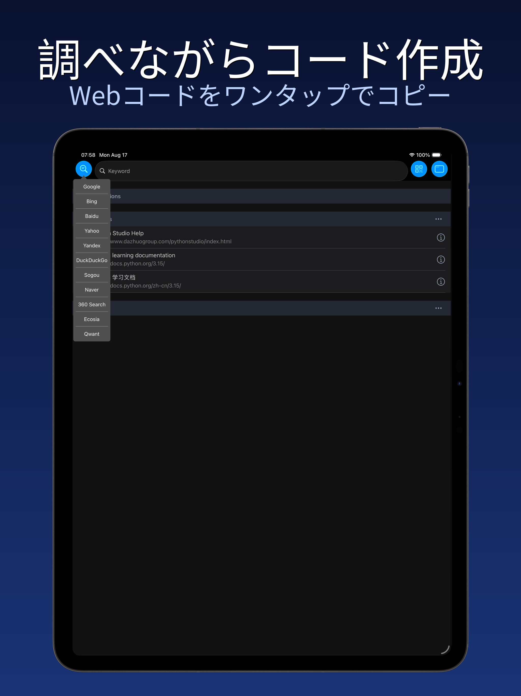

  

<h1 align="center">Pythonスタジオ - Pythonプログラミング</h1>

  <strong>iPhone / iPad / Mac をポータブルな Python コーディング工房に</strong>

  <a href="https://apps.apple.com/app/id6749899391"><strong>⬇️ App Store からダウンロード</strong></a>

  <a href="#主な機能">主な機能</a> ·
  <a href="#スクリーンショット">スクリーンショット</a> ·
  <a href="#使い方">使い方</a> ·
  <a href="#プライバシーと規約">プライバシーと規約</a>

  🌐 <a href="README.md">简体中文</a> · <a href="README.en.md">English</a> · <a href="README.ko.md">한국어</a> · <a href="README.es.md">Español</a>

---

PythonStudio は iPhone・iPad・Mac（Mac Catalyst）向けに設計された、Python プログラミングの利便性とパワーをモバイル端末にもたらす開発ツールです。コードの世界に踏み出したばかりの初心者から、経験豊富な開発者まで、直感的な操作でスムーズなコーディング体験を提供します。開発の全シーンをカバーし、いつでもどこでも自由にプログラミングできます。

## 主な機能

- **その場で書いて即実行**：複雑な設定は不要。デバイス上で Python スクリプトの作成・編集・実行を完結し、結果をリアルタイムに確認できます；
- **スマートなコーディング支援**：シンタックスハイライト、自動インデント、コード補完で構文エラーを根本から削減。集中力と生産性を維持します；
- **デバイス間ファイル管理**：軽量で効率的なファイルマネージャーを内蔵し、PC とモバイルのプロジェクトファイルをシームレスに連携；
- **学習用ブラウザ統合**：アプリを離れずにプログラミング学習リソースへアクセス。ドキュメント参照・チュートリアル視聴・コード作成を同時に進行；
- **柔軟なマルチウィンドウ**：複数ウィンドウを同時に開き、ドラッグで移動、ピンチでサイズ変更、分割表示でコード比較や資料参照が可能；
- **コードスニペット**：効率的なコードエディターを内蔵し、コードスニペットを素早く編集・実行、グラフィック出力にも対応；
- **Notebook ノートブック対応**：`.ipynb` ノートブックの開閉・編集・実行をオフラインで実行可能。

## スクリーンショット

### iPhone

  
  
  
  

### iPad

  
  

  
  

## 使い方

> 本リポジトリにはプロジェクト紹介とメタデータのみが含まれ、ソースコードは含まれません。iOS / iPadOS / macOS（Catalyst）アプリです。

1. **App Store** で「Python 编程」を検索、または公式ページからダウンロード；
2. 初回起動時に自動で初期化が完了し、すぐに利用可能；
3. 「コードスニペット」を開いて Python コードを作成・実行；
4. `.py` / `.ipynb` / `.md` / `.csv` などのファイルをインポートして編集。

## プライバシーと規約

- プライバシーポリシー：<http://www.dazhuogroup.com/pythonstudio/privacy_statement_en.php>
- 利用規約：<http://www.dazhuogroup.com/pythonstudio/terms_of_use_en.php>

## License

本リポジトリのメタデータと紹介コンテンツは著作権で保護されています。無断転載を禁じます。ソースコードは公開されていません。
