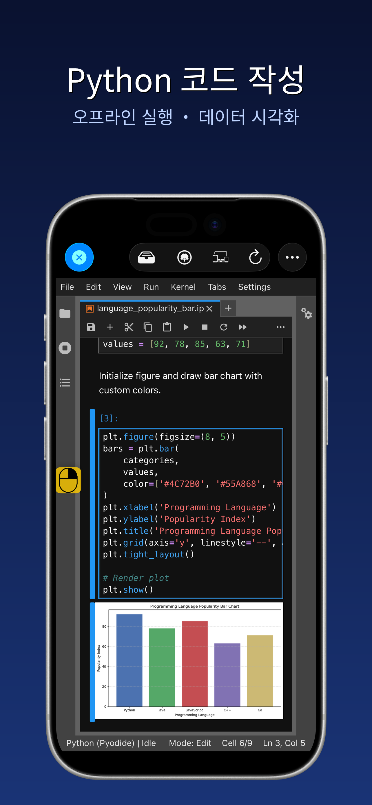
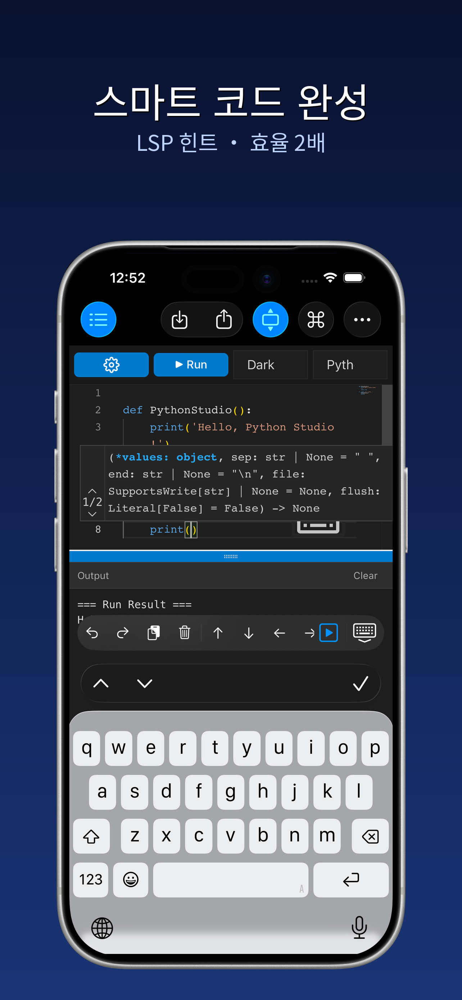
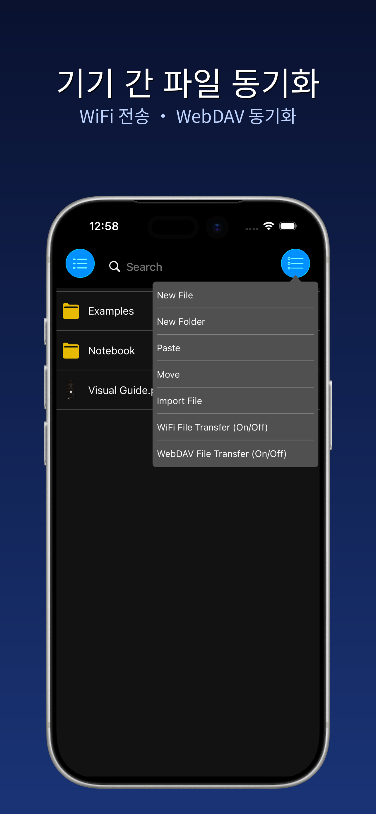
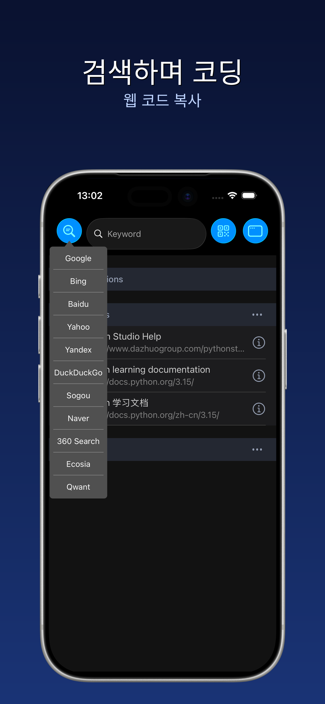
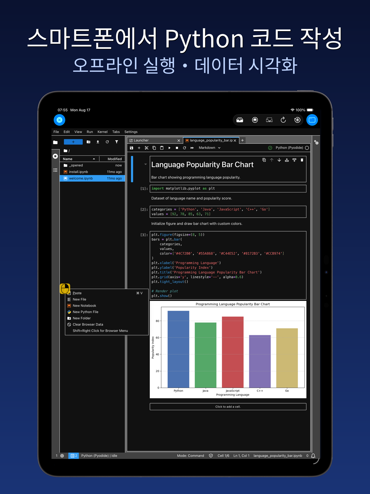
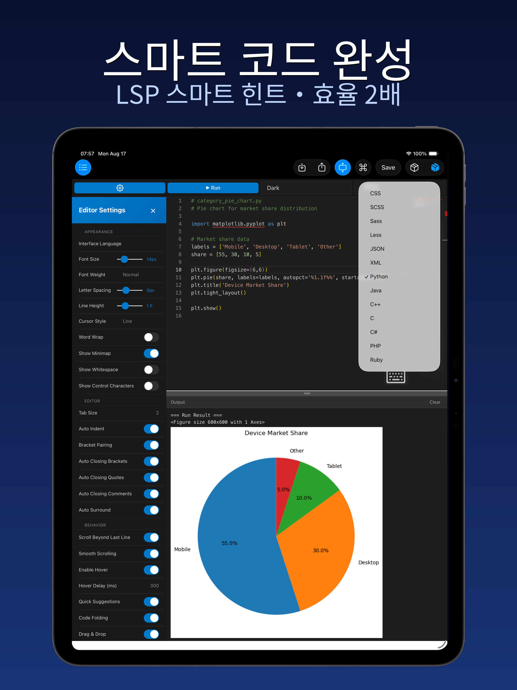
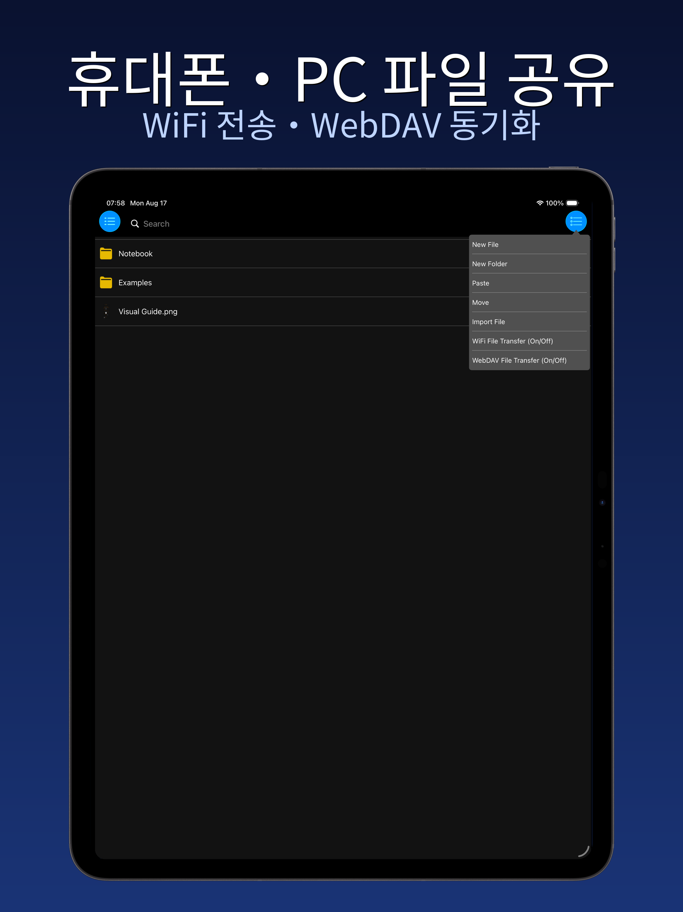
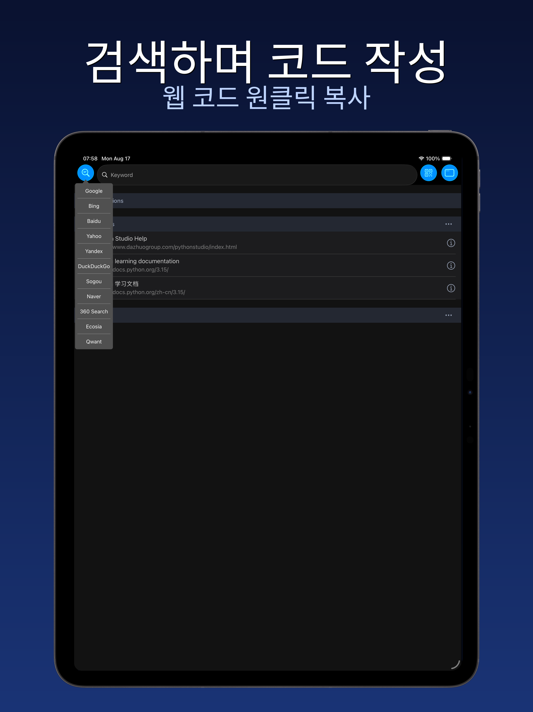

  

<h1 align="center">파이썬 스튜디오 - 파이썬 프로그래밍</h1>

  <strong>iPhone / iPad / Mac을 휴대용 Python 코딩 공방으로</strong>

  

  <a href="#주요-기능">주요 기능</a> ·
  <a href="#스크린샷">스크린샷</a> ·
  <a href="#시작하기">시작하기</a> ·
  <a href="#개인정보-및-약관">개인정보 및 약관</a>

  🌐 <a href="README.md">简体中文</a> · <a href="README.en.md">English</a> · <a href="README.ja.md">日本語</a> · <a href="README.es.md">Español</a>

---

PythonStudio는 iPhone·iPad·Mac(Mac Catalyst)을 위해 설계된 앱으로, Python 프로그래밍의 편리함과 강력함을 모바일 기기에 그대로 담아냅니다. 코딩을 처음 시작하는 초보자부터 경험 많은 개발자까지, 직관적인 조작으로 진입 장벽을 낮추고 개발 전 과정을 아우르는 풍부한 기능을 제공합니다. 언제 어디서나 자유롭게 프로그래밍하세요.

## 주요 기능

- **즉시 작성·즉시 실행**：복잡한 설정 없이 기기에서 바로 Python 스크립트를 작성·편집·실행하고 결과를 실시간으로 확인할 수 있습니다；
- **스마트 코딩 지원**：구문 강조, 자동 들여쓰기, 지능형 코드 완성으로 오타와 문법 오류를 원천 차단해 더욱 집중하고 효율적으로 작업할 수 있습니다；
- **기기 간 파일 관리**：가볍고 효율적인 파일 관리 도구를 내장해 PC와 모바일의 프로젝트 파일을 매끄럽게 연결합니다；
- **학습용 브라우저 통합**：앱을 벗어나지 않고 프로그래밍 학습 자료에 접근해 문서 확인·튜토리얼 시청·코드 작성이 동시에 가능합니다；
- **유연한 멀티 윈도우**：여러 창을 동시에 열고 드래그로 이동, 핀치로 크기 조절, 분할 화면으로 코드 비교와 자료 탐색을 병행할 수 있습니다；
- **코드 스니펫**：효율적인 코드 에디터를 내장해 코드 스니펫을 빠르게 편집·실행하고 그래픽 출력도 지원합니다；
- **Notebook 노트북 지원**：`.ipynb` 노트북을 오프라인으로 열고 편집·실행할 수 있습니다.

## 스크린샷

### iPhone

  
  
  
  

### iPad

  
  

  
  

## 시작하기

> 이 저장소에는 프로젝트 소개와 메타데이터만 포함되며 소스 코드는 포함되지 않습니다. iOS / iPadOS / macOS(Catalyst) 앱입니다.

1. **App Store**에서 「Python 编程」을 검색하거나 공식 페이지에서 다운로드；
2. 첫 실행 시 자동으로 초기화가 완료되어 바로 사용할 수 있습니다；
3. 「코드 스니펫」을 열어 Python 코드를 작성하고 실행하세요；
4. `.py` / `.ipynb` / `.md` / `.csv` 파일을 가져와 편집할 수 있습니다.

## 개인정보 및 약관

- 개인정보 처리방침：<http://www.dazhuogroup.com/pythonstudio/privacy_statement_en.php>
- 이용약관：<http://www.dazhuogroup.com/pythonstudio/terms_of_use_en.php>

## License

이 저장소의 메타데이터와 소개 콘텐츠는 저작권으로 보호됩니다. 무단 복제를 금합니다. 소스 코드는 공개되지 않았습니다.
