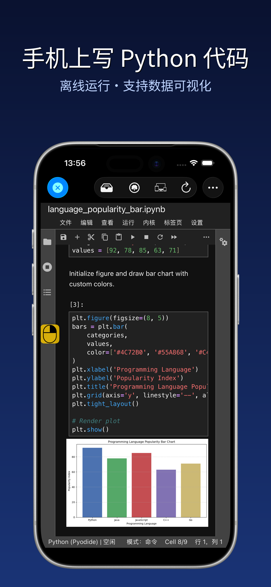
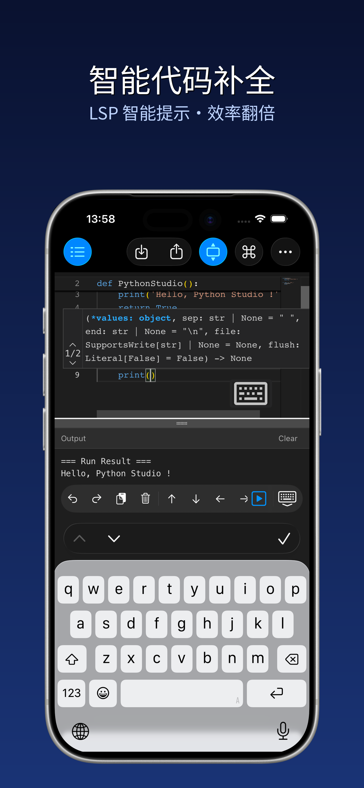
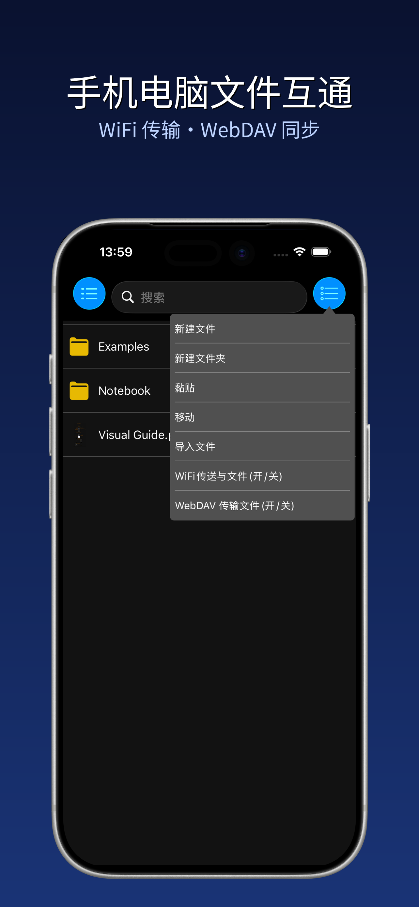
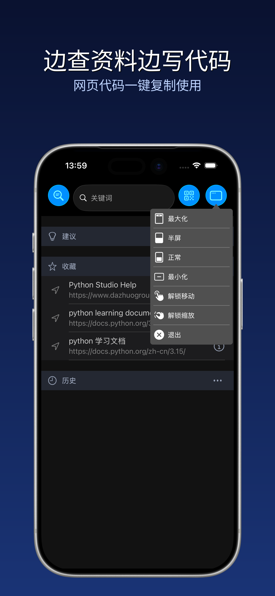
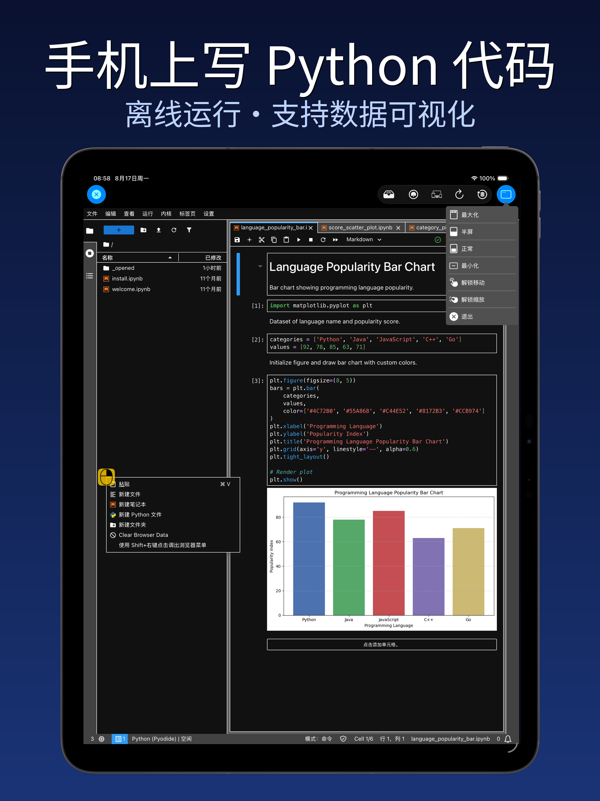
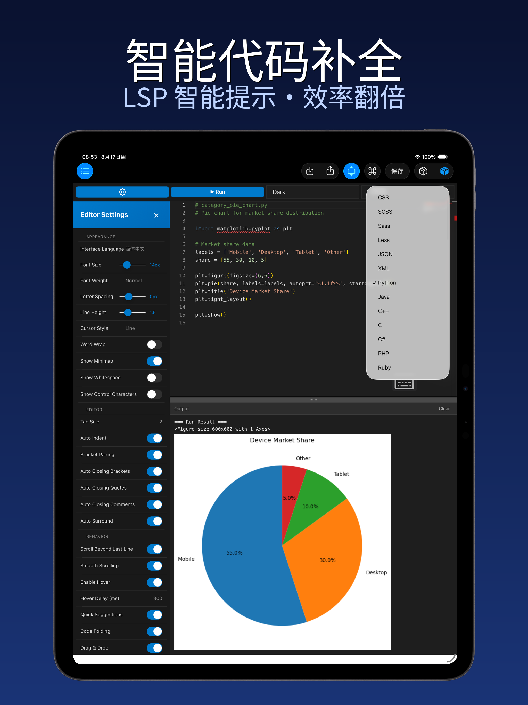
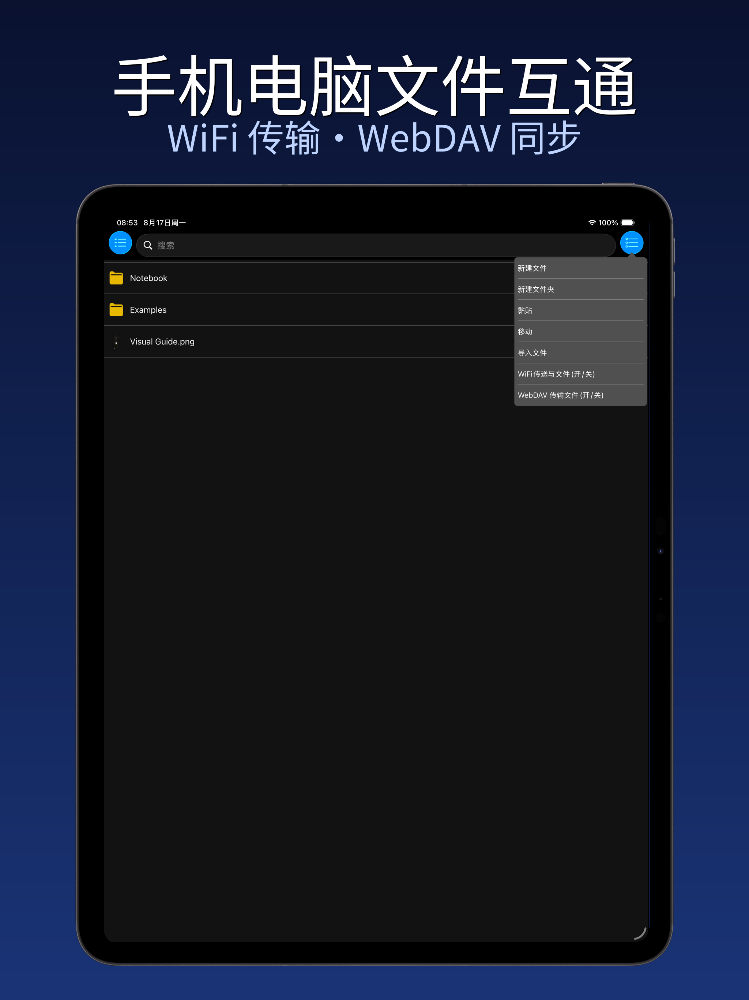
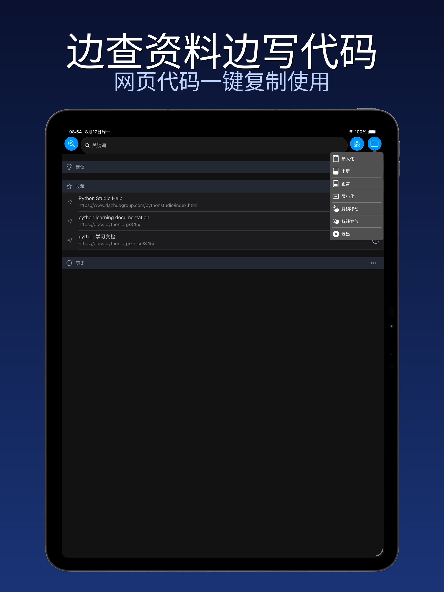

  

<h1 align="center">PythonStudio · 移动端 Python 开发工具</h1>

  <strong>让 iPhone / iPad / Mac 变身随身 Python 编程工坊</strong>

  

  <a href="#功能亮点">功能亮点</a> ·
  <a href="#截图">截图</a> ·
  <a href="#开始使用">开始使用</a> ·
  <a href="#隐私与条款">隐私与条款</a>

  🌐 <a href="README.en.md">English</a> · <a href="README.ja.md">日本語</a> · <a href="README.ko.md">한국어</a> · <a href="README.es.md">Español</a>

---

PythonStudio 专为 iPhone、iPad 与 Mac（Mac Catalyst）量身打造，为 Python 编程注入移动端的便捷与强大。无论你是初探代码世界的编程新人，还是深耕技术领域的资深开发者，都能在这里找到高效流畅的编码体验——直观交互消解操作门槛，丰富功能覆盖开发全场景，让每一次敲击键盘都成为享受，轻松解锁随时随地编程的自由。

## 功能亮点

- **即写即运行的脚本开发**：无需复杂配置，在设备上直接完成 Python 脚本的编写、编辑与运行，代码效果实时呈现，创意落地快人一步；
- **智能护航的编码辅助**：语法高亮清晰区分代码结构，自动缩进规范代码格式，代码补全精准预判输入需求，从根源减少语法错误，让编码更专注、更高效；
- **跨端协同的文件管理**：集成轻量化高效文件管理工具，无缝衔接电脑与手机端项目文件，文件管理从此告别繁琐；
- **边学边练的浏览器集成**：内置专属浏览器功能，无需切换应用即可直达编程学习资源，查文档、看教程、学案例与写代码同步进行，学习效率翻倍；
- **灵活自由的多窗操作**：支持多窗口同时打开，拖拽调整位置、缩放控制大小，分屏对比代码、边查资料边编写，多任务处理游刃有余；
- **代码速写**：内置高效代码编辑器，快速编辑代码片段，支持图形输出，即写即跑；
- **Notebook 笔记本支持**：支持打开、编辑、运行 `.ipynb` 笔记本，无需联网即可运行 Python。

## 截图

### iPhone

  
  
  
  

### iPad

  
  

  
  

## 开始使用

> 本仓库仅包含项目介绍与元数据，不包含源代码。项目为 iOS / iPadOS / macOS（Catalyst）应用。

1. 在 **App Store** 搜索「Python 编程」或访问官方页面下载；
2. 首次启动后，App 会自动完成初始化，即可开始使用；
3. 打开「代码速写」即可编写并运行 Python 代码；
4. 支持导入 `.py` / `.ipynb` / `.md` / `.csv` 等文件进行编辑。

## 隐私与条款

- 隐私政策：<http://www.dazhuogroup.com/pythonstudio/privacy_statement_en.php>
- 使用条款：<http://www.dazhuogroup.com/pythonstudio/terms_of_use_en.php>

## License

本仓库的元数据与介绍内容受版权保护，保留所有权利。源代码未公开。
